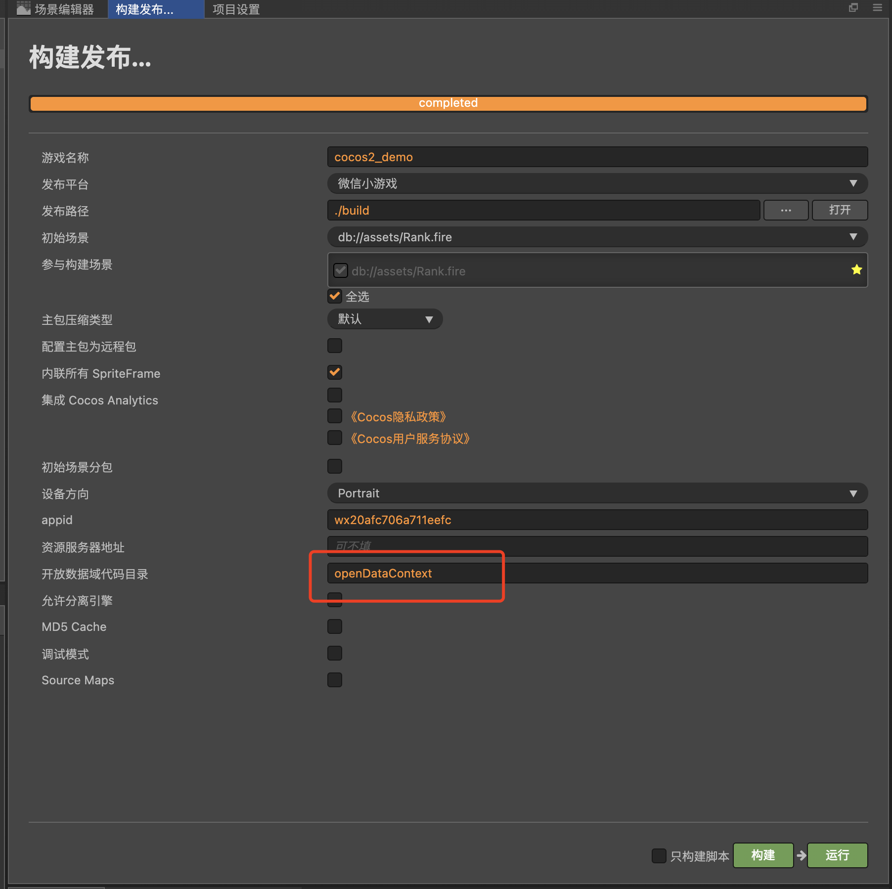
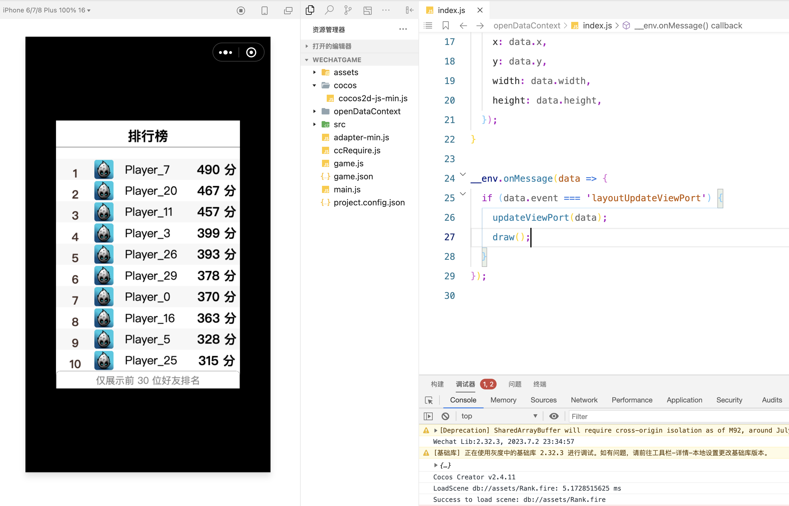

# cocos2.x版本适配

## 简介
Cocos Creator 2.x 自带支持开放数据域开发，详情可见[文档](https://docs.cocos.com/creator/2.4/manual/zh/publish/publish-wechatgame-sub-domain.html)。

Cocos Creator 2.x 对开放数据域的支持原理为开放数据域同样为一个完整的 Cocos 项目，在主域通过 `SubContextView` 组件来实现开放数据域的绘制和更新等逻辑。使用 Cocos 来开发开放数据域好处在于在开放数据域也是一个完整的游戏引擎在驱动，因此可以有更丰富的 UI 效果，但弊端也不少，比如 开放数据域也需要一个引擎、每次调试需要构建等，因此 Cocos Creator 3.x 开放数据域开发方案换成了 Layout 方案，详情可见[文档](https://docs.cocos.com/creator/manual/zh/editor/publish/build-open-data-context.html)。

实际上，Cocos Creator 2.x 同样支持使用 Layout 来开发开放数据域，本文详细介绍。

## 适配流程
### 1. 项目创建
本文采用 Cocos Creator 2.4.11 版本 ，低版本的处理大同小异。

示例很简单，添加一个精灵，精灵挂载 `SubContextView` 组件和 一个自定义脚本(`Rank`)，如下图所示。


挂载了`SubContextView`组件之后，按照 Cocos 默认的流程，会自动给开放数据域发送几个事件：viewport、boot、frameRate然后开放数据域的 Cocos 工程会根据这些事件做一些处理保证游戏主域和开放数据域配合工作（核心是事件处理）。

如果使用 Layout 来处理开放数据域，我们忽略这些 Cocos 的事件，通过挂载的自定义脚本来处理。
```js
const { ccclass, property } = cc._decorator;

@ccclass
export default class NewClass extends cc.Component {
  start() {
    /**
     * 开放数据域用 Layout 来实现，必须告诉 Layout 开放数据域最终被绘制到屏幕上的包围盒
     * 比如 iPhone 12 Pro Max 的物理尺寸是 414 * 896，如果开放数据域的尺寸是 200 * 200，绘制在屏幕正中央
     * 那么最终包围盒是{ x: 107, y: 348, width: 200, height: 200 }
     * 但在 Cocos 中是跟 Cocos 的坐标系打交道，因此要将 Cocos 的坐标系换算成木屏幕坐标系，坐标原点为左上角
     * 下面是参考转换逻辑
     */

    // 返回节点在世界坐标系下的对齐轴向的包围盒（AABB），这个包围盒是相对于设计尺寸的
    const box = this.node.getBoundingBoxToWorld();
    // Cocos 的屏幕适配规则，详情可见：https://docs.cocos.com/creator/2.4/manual/zh/ui/multi-resolution.html?h=%E9%80%82%E9%85%8D
    const scaleX = cc.view.getScaleX();
    const scaleY = cc.view.getScaleY();
    const devicePixelRatio = cc.view.getDevicePixelRatio();
    // 设计尺寸
    const designSize = cc.view.getDesignResolutionSize();
    // canvas 画布的尺寸
    const vireportRect = cc.view.getViewportRect();
    // Cocos 实际的场景在 Canvas 画布中的偏移，比如按照 fixWidth 的适配规则而屏幕有比较长的话，最终渲染出来屏幕上下是有黑边的，这里计算的就是黑边的大小
    const offsetY = (vireportRect.height - (designSize.height * scaleY)) / 2;
    const offsetX = (vireportRect.width - (designSize.width * scaleX)) / 2;

    // 将计算出来的相对屏幕的包围盒信息发送给开放数据域，开放数据域根据这个事件来初始化
    window.__globalAdapter && window.__globalAdapter.getOpenDataContext().postMessage({
      event: 'layoutUpdateViewPort',
      x: ((box.x * scaleX) + offsetX) / devicePixelRatio,
      y: (box.y * scaleY + offsetY) / devicePixelRatio,
      width: box.width * scaleX / devicePixelRatio,
      height: box.height * scaleY / devicePixelRatio,
    })
  }
}
```

### 2. 项目打包
打包构建只需要在构建时填写个开放数据域代码目录即可，到此 Cocos 工程内的工作已经结束。


### 3. 开放数据域工程
开放数据域工程放在 `openDataContext` 目录，直接使用 Cocos Creator 3.x 版本生成的开放数据域模板经过简单魔改即可，
``` js
__env.onMessage(data => {
  
  // 注释的部分为 Cocos Creator 3.x 逻辑
  // if ( data.type === 'engine' && data.event === 'viewport' ) {
  if (data.event === 'layoutUpdateViewPort') {
    updateViewPort(data);
    draw();
  }
});
```

经过魔改的开放数据域目录可见 [openDataContext](https://github.com/wechat-miniprogram/minigame-canvas-engine/tree/master/demos/cocos2.x_demo/build/wechatgame/openDataContext)，最后的运行效果如下：



经过改造后，开放数据域的所有调试都可以在微信开发者工具内实现，不需要在 Cocos 打包单独的开放数据域工程，同时 `openDataContext` 目录内的 engine.js 也可以删除，通过 [微信小游戏插件](../overview/plugin)的方式引用。

完成工程可见[cocos2.x_demo](https://github.com/wechat-miniprogram/minigame-canvas-engine/tree/master/demos/cocos2.x_demo)